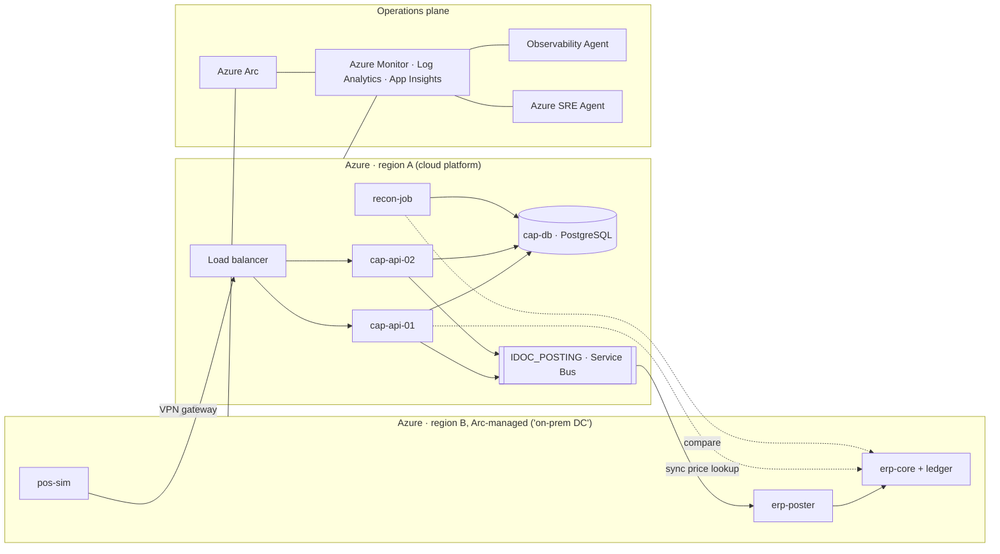

# RetailTx — Agentic Operations for a Hybrid Retail Estate

> A demo environment that mimics a business‑critical retail transaction chain split across **on‑premises** and **Azure**, used to show how an *agentic operating model* (Azure Arc, Azure Monitor, Observability Agent, Azure SRE Agent and specialised agents) helps a small operations team run a hybrid landscape — without migrating first.

- **Status:** v0.1 in progress (Azure‑only, Arc‑honest)
- **Stack:** Bicep · Python/FastAPI · PostgreSQL · Azure Service Bus · Azure Monitor · Azure Arc · Azure SRE Agent
- **Not SAP:** the app is *SAP‑like*. Component names are generic on purpose.

---

## 1. Why this exists

The reference customer is a European food retailer operating in four countries with a **hybrid core landscape**:

- a core retail **ERP that stays on‑premises for years** (hardware approaching lifecycle limits),
- a **customer activity / pricing platform** that is being modernised toward the cloud,
- analytics already in Azure,
- a **small operations team** with little capacity for large transformation programmes,
- vendor pressure toward a future ERP architecture, creating uncertainty about timing and ownership.

Operationally the concern is simple: **latency and reliability of retail transactions** (pricing, payment, posting) across interconnected systems. Degradation is rarely a "server down" — it is a slow hop across the boundary, a growing interface backlog, a late batch job — and today it means navigating several monitoring tools and silos to find out what is happening and what it means for the stores.

The demo answers one question:

> *What can we apply today, in AI‑assisted and agentic IT operations, on a landscape that is — and will remain — hybrid?*

## 2. Narrative: four layers

| Layer | Role | Message |
|---|---|---|
| **1 · Foundation** — Azure Arc + Azure Monitor / Log Analytics / Application Insights | One control and telemetry plane over on‑prem and cloud | *Agentic operations starts with observability, not with AI.* |
| **2 · Analyst** — Observability Agent | Understands what is happening, what is affected, which dependencies are involved | Hypotheses and correlation, not actions |
| **3 · Operator** — Azure SRE Agent | Observe → Diagnose → Prevent → Heal; proposes and (with approval) executes; records knowledge | *Operational work in, evidence‑backed outcomes out* |
| **4 · Specialised agents** — Security (Defender), GitHub Copilot, Azure AI Foundry / Copilot Studio | Fix the code, secure the estate, add business context | A team of agents, humans keep the policy |

Humans set policy and guardrails, approve actions and review outcomes. Agents investigate, correlate, document and remediate.

## 3. Session flow (60 min)

| # | Block | Min | Form |
|---|---|---|---|
| 0 | Goal and agenda | 3 | slides |
| 1 | Customer's situation today: tools, on‑call, what hybrid makes hard | 7 | conversation |
| 2 | **Presentation** — from monitoring to an agentic operating model for hybrid IT (`docs/presentation-outline.md`) | 12 | slides |
| 3 | **Demo 1 — the agentic NOC**, one incident end to end | 14 | live |
| 4 | **Walkthrough — inside the SRE Agent**: reasoning, context, guardrails | 10 | live |
| 5 | **Demo 2 — Prevent**: proactive coexistence operations | 5 | live |
| 6 | Pick 1–2 scenarios, next steps | 9 | conversation |

## 4. Scenarios

### Demo 1 — Transaction degradation across the boundary (agentic NOC)

**Story.** Promotion morning. Prices are maintained in the on‑prem ERP and used by the cloud pricing platform; accepted transactions are posted back to the ERP ledger through a queue. Nothing is "down", but checkout latency rises and unposted sales grow in two countries just before stores open.

**Flow (what the audience sees).**

1. Anomaly detected (dynamic threshold): checkout p95 latency and posting backlog deviate from the normal promo‑morning curve.
2. **Observability Agent** analyses impact and dependencies: which countries, which hop (cloud → on‑prem price lookup), which components.
3. **SRE Agent** investigates: traces across the VPN, queue depth, last night's configuration change, a long‑running batch job on the ERP host.
4. Root cause stated with evidence; symptoms separated from cause.
5. Business impact in plain language: stores and brands affected per country, exposure window.
6. Mitigation proposed (release backlog / restart poster / add cloud capacity).
7. Engineer approves.
8. SRE Agent executes, confirms recovery, writes the RCA and stores the knowledge.

**Triggers:** `chaos/latency`, `chaos/backlog`, `chaos/batch-hog` (see §7).
**Success criteria:** end‑to‑end in ≤ 12 min without a terminal; impact expressed per country; approval step visible; RCA produced.
**Aside (60 s):** natural‑language questions to the estate ("which interfaces failed this week?").

### Walkthrough — inside the SRE Agent

Talk track, shown in the product where possible:

- **What it is:** an agent with its own identity next to the Azure estate and Arc‑connected machines; reacts to alerts or schedules; reasons over metrics, logs, changes and topology.
- **How it reasons:** hypothesis → evidence → conclusion → proposed action. It shows its work.
- **Giving it context** (`docs/agent-context/`):
  - *Scope* — resource groups and Arc machines it may see.
  - *Knowledge* — plain‑language runbooks and architecture notes (`runbooks/`).
  - *Business context* — store/brand/country mapping (`store-map.csv`).
  - *Integrations* — alert sources, ITSM, chat.
- **Guardrails:** read‑only vs. act modes; per‑action approval and approver groups; action allow‑list (`allowed-actions.md`); least‑privilege RBAC on the agent identity; full audit trail; off switch; human review of RCAs.
- **Honest limits:** preview status; only what telemetry reaches Azure; no coverage for non‑Arc platforms (e.g. proprietary Unix); quality depends on the context you give it.

### Demo 2 — Prevent: proactive coexistence operations

- **Morning landscape brief** across the four countries: interface backlog trend, batch SLA compliance, failed jobs with likely cause, changes in the last 24 h.
- **Pre‑flight before peak day:** capacity headroom, queue health, certificate/patch status, replication gaps → green, or a proposed action.
- **Headroom forecast** on the ERP host (disk/memory days‑to‑full) — quietly links operations to the hardware lifecycle decision.
- **Hygiene with approval:** one approve/snooze/explain card (restart stuck worker, clean logs).

**Triggers:** `chaos/headroom`, `chaos/redundancy`, `chaos/cert`.

### Layer 4 hooks (include as time allows; prepared for the prep session)

| Hook | Shows | Effort |
|---|---|---|
| GitHub Copilot drafts the runbook / config fix from the RCA | agents fix code, not just infra | low |
| Foundry / Copilot Studio "store impact" agent answering "which stores open in the next hour in the affected countries?" | business context on top of the same telemetry | medium |
| Defender signal in the incident thread (e.g. unexpected outbound connection on the ERP host) | security as part of the same operating model | medium |

### Out of scope

Proprietary Unix / non‑Arc platforms · ERP vendor architecture debate · Kubernetes/app‑platform SRE · deep dependency discovery (that is an assessment, not operations).

## 5. Application design — RetailTx

```
pos-sim (4 countries × brands) ──POST /transaction──► cap-api (cloud)
                                                        │  sync GET /price/{sku} ──► erp-core (on‑prem)
                                                        │  write cap-db
                                                        └─► queue IDOC_POSTING ──► erp-poster (on‑prem) ──► erp-core ledger
recon-job: accepted‑in‑cloud vs posted‑on‑prem → unposted € per country
```

| Component | Side | Plays | Tech |
|---|---|---|---|
| `pos-sim` | on‑prem | stores / POS | Python load generator; profiles `baseline`, `promo`, `peak-day` |
| `cap-api` | cloud | customer activity / pricing platform | FastAPI on 2 VMs behind LB; PostgreSQL Flexible |
| `erp-core` | on‑prem | core ERP: price service + ledger | FastAPI + PostgreSQL |
| `IDOC_POSTING` | cloud | interface layer | Azure Service Bus queue |
| `erp-poster` | on‑prem | posting worker (single instance, by design) | Python worker |
| `recon-job` | cloud | reconciliation | scheduled job → custom metric `unposted_eur{country}` |

**Two dependencies, two concerns:** the *sync* price lookup carries the **latency** story; the *async* posting queue carries the **reliability** story. `unposted_eur` is the one business metric everything hangs on.

**Telemetry contract.** OpenTelemetry → Application Insights (distributed trace across the VPN); custom metrics `checkout_latency_ms`, `checkout_failed_ratio`, `queue_depth`, `unposted_eur`, all dimensioned by `country` and `brand`; structured logs; Change Tracking on config files; host metrics via Azure Monitor Agent (through Arc on the on‑prem side).

## 6. Architecture by release

### v0.1 — Azure‑only, Arc‑honest *(target: before rehearsal)*

- Two VNets in two regions, joined by **VPN Gateway** (real tunnel, real cross‑region latency). Region B plays the on‑prem datacenter.
- "On‑prem" VMs are **onboarded to Azure Arc** (IMDS‑blocked evaluation pattern) and managed **only** through Arc: AMA, Change Tracking, Update Manager, Run Command.
- Service Bus, PostgreSQL Flexible, Log Analytics, Application Insights, one workbook (*Retail transaction health* by country), dynamic‑threshold alerts.
- **Azure SRE Agent** scoped to both resource groups + Arc machines, with runbooks, store map and action allow‑list (restart `erp-poster`, scale `cap-api`).
- Observability Agent enabled on the workspace (see §11 for status risk).



### v0.2 — Realism

Chaos library with undo · `promo` and `peak-day` load profiles · store‑impact table · on‑prem monitoring look‑alike (Prometheus/Grafana or Zabbix) as "where the alert starts" · ITSM stub · Layer‑4 hooks (§4).

### v1.0 — Real hybrid

Move `erp-*` and `pos-sim` to a **Proxmox homelab**; real site‑to‑site VPN; same Arc onboarding script; optional RabbitMQ on‑prem instead of Service Bus. Application code unchanged.

### Backlog

Update Manager patch wave · config‑drift detection via Change Tracking · cost view · multi‑agent hand‑off (Observability → SRE) once GA.

## 7. Chaos catalogue

| Button | Demo | Action | Undo | Expected signal | Expected agent behaviour |
|---|---|---|---|---|---|
| `latency` | 1 | `tc netem` +200 ms on `erp-core` | remove qdisc | checkout p95 ↑ all countries, no host down | traces latency to price‑lookup hop across VPN |
| `backlog` | 1 | stop `erp-poster` after a logged config change | start service | `queue_depth` ↑, `unposted_eur` ↑ (2 countries first) | links to change, proposes restart, asks approval |
| `batch-hog` | 1 | `stress-ng` job named like a delta load on `erp-core` | kill job | slow lookups **and** backlog | correlates both to one cause |
| `headroom` | 2 | `fallocate` disk / memory pressure | remove file | days‑to‑full trend | proactive brief flags it |
| `redundancy` | 2 | stop one `cap-api` VM | start VM | traffic survives | flags single‑node exposure before peak day |
| `cert` | 2 | 7‑day TLS cert on `erp-core` | reissue | expiry warning | pre‑flight catches it |

Every button is a script in `chaos/` with `--undo`.

## 8. Repository layout

```
infra/        Bicep: network, vpn, compute, data, monitor, agents (per module)
app/          cap-api/, erp-core/, erp-poster/, recon-job/  (FastAPI/Python, Dockerfiles)
sim/          pos-sim load generator and profiles
chaos/        failure buttons with --undo
docs/
  presentation-outline.md
  agent-context/  runbooks/, architecture.md, store-map.csv, allowed-actions.md, rbac.md
  layer-4-hooks.md
  runsheet.md
```

**Naming & tags.** `rg-retailtx-cloud-<region>`, `rg-retailtx-onprem-<region>`; hosts `cap-api-01`, `erp-core-01`, `erp-poster-01`, `pos-sim-01`. Tags: `system=CAP|ERP`, `site=cloud|dc1`, `country=country-1..4`, `demo=retailtx`.

## 9. Build plan

| Week | Deliverable | Exit criterion |
|---|---|---|
| 1 | VNets + VPN, 2 cloud VMs, 3 "on‑prem" VMs on Arc, `cap-api` + `erp-core`, `pos-sim`, App Insights | one transaction visible POS → ledger with latency per hop |
| 2 | queue + poster + recon metric, workbook, dynamic alerts, chaos buttons, agent context docs | each button gives a clear, repeatable signal |
| 3 | SRE Agent onboarded with runbooks and allow‑list, Observability Agent, layer‑4 hooks as time allows, rehearsal, fallback recording | 15‑min run‑through without a terminal |

## 10. Demo‑day run sheet (short)

1. Pre‑checks: VPN up, `pos-sim` on `promo` profile, all buttons undone, agent idle, recording ready as fallback.
2. Demo 1: `backlog` → wait for alert → follow the thread → approve → RCA. Keep `latency` ready if time allows.
3. Walkthrough: open scope, one runbook, store map, allow‑list, audit log.
4. Demo 2: open the scheduled brief; `headroom` pre‑fired an hour earlier.
5. Reset all buttons.

**If asked "is this really on‑prem?"** — "For the demo it runs in a separate network we manage exactly as on‑prem, through Azure Arc: same agent, same actions. The next step is doing this on one of your servers."

## 11. Open questions & risks

- [ ] Observability Agent availability/preview status and hand‑off to SRE Agent — fallback: SRE Agent alone covers steps 2–8.
- [ ] SRE Agent action support on **Arc‑connected machines** — decides whether *Heal* is live or a proposed action.
- [ ] SRE Agent preview enrolment / region for the subscription.
- [ ] Which on‑prem monitoring tool the customer actually uses (mimic it in v0.2).
- [ ] Homelab public IP/DDNS and upload bandwidth (v1.0 only).
- [ ] Cost guardrail: budget alert on both resource groups; VPN gateways and VMs are the main spend.

## 12. Conventions

- Keep the README short; details live in `docs/`.
- No customer, people or account names anywhere in this repository.
- Every chaos script has `--undo`; every agent action is on the allow‑list; every change to `docs/agent-context/` is reviewed.
