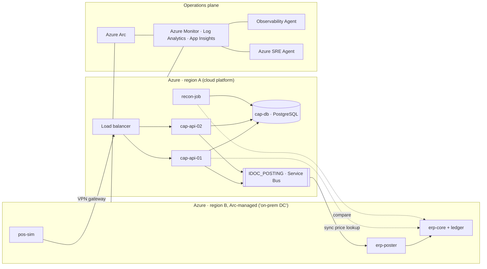

# RetailTx — Agentic Operations for a Hybrid Retail Estate

> A demo environment that mimics a business‑critical retail transaction chain split across **on‑premises** and **Azure**, used to show how an *agentic operating model* (Azure Arc, Azure Monitor, Observability Agent, Azure SRE Agent and specialised agents) helps a small operations team run a hybrid landscape — without migrating first.

- **Status:** design only; application and infrastructure implementation not started
- **Stack:** Bicep · Python/FastAPI · PostgreSQL · Azure Service Bus · Azure Monitor · Azure Arc · Azure SRE Agent
- **Not SAP:** the app is *SAP‑like*. Component names are generic on purpose.

**Delivery source of truth:** [staged architecture and implementation plan](../docs/implementation-plan.md).
The plan records proposed stages, deployment/reset/teardown requirements, verified
product boundaries, and unresolved integration gates. The full estate below is
the longer-term vision, not the first release or a description of existing code.

---

## 1. Why this exists

The reference customer is a European food retailer operating in four countries with a **hybrid core landscape**:

- a core retail **ERP that stays on‑premises for years** (hardware approaching lifecycle limits),
- a **customer activity / pricing platform** that is being modernised toward the cloud,
- analytics already in Azure,
- a **small operations team** with little capacity for large transformation programmes,
- vendor pressure toward a future ERP architecture, creating uncertainty about timing and ownership.

Operationally the concern is simple: **latency and reliability of retail transactions** (pricing, payment, posting) across interconnected systems. Degradation is rarely a "server down" — it is a slow hop across the boundary, a growing interface backlog, a late batch job — and today it means navigating several monitoring tools and silos to find out what is happening and what it means for the stores.

The demo answers one question:

> *What can we apply today, in AI‑assisted and agentic IT operations, on a landscape that is — and will remain — hybrid?*

## 2. Narrative: foundation, operational loop, optional specialists

| Layer | Role | Message |
|---|---|---|
| **1 · Foundation** — Azure Arc + Azure Monitor / Log Analytics / Application Insights | One control and telemetry plane over on‑prem and cloud | *Agentic operations starts with observability, not with AI.* |
| **2 · Operational loop** — Azure SRE Agent | Investigates, correlates evidence, proposes and (with configured approval) executes supported actions; records outcomes | *Operational work in, evidence‑backed outcomes out* |
| **Optional analyst experience** — Azure Copilot Observability Agent | Azure Monitor-native chat, deep investigations, saved issues, and preview autonomous alert correlation; does not remediate resources | An alternative investigation/triage experience, not a prerequisite for SRE Agent |
| **3 · Optional specialised agents** — Security (Defender), GitHub Copilot, Microsoft Foundry / Copilot Studio | Fix the code, secure the estate, add business context | A team of agents, humans keep the policy |

Humans set policy and guardrails, approve actions and review outcomes. Agents investigate, correlate, document and remediate.
SRE Agent already performs analysis; do not stage a redundant Observability-to-SRE
handoff unless a separately verified integration demonstrates a distinct outcome.

## 3. Session flow (60 min)

| # | Block | Min | Form |
|---|---|---|---|
| 0 | Goal and agenda | 3 | slides |
| 1 | Customer's situation today: tools, on‑call, what hybrid makes hard | 7 | conversation |
| 2 | **Presentation** — from monitoring to an agentic operating model for hybrid IT (`docs/presentation-outline.md`) | 12 | slides |
| 3 | **Demo 1 — the agentic NOC**, one incident end to end | 14 | live |
| 4 | **Walkthrough — inside the SRE Agent**: reasoning, context, guardrails | 10 | live |
| 5 | **Demo 2 — Prevent**: proactive coexistence operations | 5 | live |
| 6 | Pick 1–2 scenarios, next steps | 9 | conversation |

## 4. Scenarios

### Demo 1 — Transaction degradation across the boundary (agentic NOC)

**Story.** Promotion morning. Prices are maintained in the on‑prem ERP and used by the cloud pricing platform; accepted transactions are posted back to the ERP ledger through a queue. The first incident stops the posting worker while checkout stays healthy. Unposted sales grow, with a repeatable load profile making two countries dominate the initial signal. A shared stopped worker eventually affects all countries. Add checkout latency as a separate later scenario.

**Flow (what the audience sees).**

1. A deterministic static alert detects posting backlog or unposted sales in the fresh environment.
2. **SRE Agent** analyses impact and dependencies: affected countries, transaction state, worker health, and available telemetry.
3. The same agent investigates queue depth and the logged fault/change event. VPN and batch-job evidence belong to later profiles, not the initial incident.
4. Root cause stated with evidence; symptoms separated from cause.
5. Business impact in plain language: stores and brands affected per country, exposure window.
6. Mitigation proposed: restart the posting worker using a verified fixed-action path. Other actions require their own scenario and permission gates.
7. Engineer approves.
8. SRE Agent executes the supported approved action, confirms recovery, writes the RCA and stores the knowledge. Until the SRE-to-Arc path is proven, show diagnosis and a human-run action explicitly instead.

**Planned triggers:** `chaos/backlog` first; `chaos/latency` and `chaos/batch-hog` later (see §7). Scripts do not exist yet.
**Target success criteria:** end‑to‑end in ≤ 12 min without a terminal after rehearsal; impact expressed per country; approval step visible; RCA produced. Deployment readiness and telemetry warm-up are measured separately.
**Aside (60 s):** natural‑language questions to the estate ("which interfaces failed this week?").

### Walkthrough — inside the SRE Agent

Talk track, shown in the product where possible:

- **What it is:** an agent with its own identity next to the Azure estate and Arc‑connected machines; reacts to alerts or schedules; reasons over metrics, logs, changes and topology.
- **How it reasons:** hypothesis → evidence → conclusion → proposed action. It shows its work.
- **Giving it context** (`docs/agent-context/`):
  - *Scope* — resource groups and Arc machines it may see.
  - *Knowledge* — plain‑language runbooks and architecture notes (`runbooks/`).
  - *Business context* — store/brand/country mapping (`store-map.csv`).
  - *Integrations* — alert sources, ITSM, chat.
- **Guardrails:** explicitly set Review for every remediation response plan and scheduled task; verify the approver role; enforce fixed actions at the tool/executor boundary in addition to the documented allow-list; least-privilege RBAC; full audit trail; off switch; human review of RCAs. Review mode does not automatically gate every external-tool action.
- **Honest limits:** verify current availability and preview surfaces; only connected telemetry is visible; non-Arc platforms may supply logs/API evidence without supported Arc host management; quality depends on context and verified integrations.

### Demo 2 — Prevent: proactive coexistence operations

- **Morning landscape brief** across the four countries: interface backlog trend, batch SLA compliance, failed jobs with likely cause, changes in the last 24 h.
- **Pre‑flight before peak day:** capacity headroom, queue health, certificate/patch status, replication gaps → green, or a proposed action.
- **Headroom forecast** on the ERP host (disk/memory days‑to‑full) — requires sufficient history; show insufficient data or clearly labeled synthetic history in a fresh environment.
- **Hygiene with approval:** one approve/snooze/explain card (restart stuck worker, clean logs).

**Triggers:** `chaos/headroom`, `chaos/redundancy`, `chaos/cert`.

### Layer 4 hooks (include as time allows; prepared for the prep session)

| Hook | Shows | Effort |
|---|---|---|
| GitHub Copilot drafts the runbook / config fix from the RCA | agents fix code, not just infra | low |
| Foundry / Copilot Studio "store impact" agent answering "which stores open in the next hour in the affected countries?" | business context on top of the same telemetry | medium |
| Defender signal in the incident thread (e.g. unexpected outbound connection on the ERP host) | security as part of the same operating model | medium |

### Out of scope

Proprietary Unix / non‑Arc platforms · ERP vendor architecture debate · Kubernetes/app‑platform SRE · deep dependency discovery (that is an assessment, not operations).

## 5. Application design — RetailTx

```text
pos-sim (4 countries × brands) ──POST /transaction──► cap-api (cloud)
                                                        │  sync GET /price/{sku} ──► erp-core (on‑prem)
                                                        │  commit transaction + outbox in cap-db
                                                        └─► outbox publisher ──► IDOC_POSTING ──► erp-poster ──► ERP ledger
recon-job: accepted‑in‑cloud vs posted‑on‑prem → unposted € per country
```

| Component | Side | Plays | Tech |
|---|---|---|---|
| `pos-sim` | on‑prem | stores / POS | Python load generator; profiles `baseline`, `promo`, `peak-day` |
| `cap-api` | cloud | customer activity / pricing platform | FastAPI on 1 VM initially; PostgreSQL Flexible; 2 VMs + LB in redundancy profile |
| `erp-core` | on‑prem | core ERP: price service + ledger | FastAPI + PostgreSQL |
| `IDOC_POSTING` | cloud | interface layer | Azure Service Bus queue |
| `erp-poster` | on‑prem | posting worker (single instance, by design) | Python worker |
| `recon-job` | cloud | reconciliation | scheduled job → custom metric `unposted_eur{country}` |

**Two dependencies, two concerns:** the *sync* price lookup carries the **latency** story; the *async* posting queue carries the **reliability** story. `unposted_eur` is the one business metric everything hangs on.

**Correctness contract.** Transactional outbox, stable transaction IDs, idempotent ERP ledger writes, bounded retries and dead-letter handling. Calculate unposted EUR from transaction state, not queue estimates. Report stale/unknown reconciliation explicitly; unposted sales are not necessarily lost revenue.

**Telemetry contract.** OpenTelemetry → Application Insights with context propagated through HTTP and queue messages; checkout duration/error evidence and business backlog dimensioned by bounded `country` and `brand` values. Native Service Bus queue depth is queue-wide, not per country. Structured logs and explicit change events first; Change Tracking later. Host metrics via Azure Monitor Agent (through Arc on the simulated on-prem side).

## 6. Architecture by release

### v0.1 — Repeatable Azure-lite incident *(proposed)*

- Two peered VNets in one region, one cloud VM and one simulated-datacenter VM. Peering is not a VPN.
- The simulated-datacenter host uses the documented **evaluation-only Azure Arc** pattern after bootstrap: remove VM extensions, disable the Azure guest agent, and block Azure IMDS. Azure owns backing hardware lifecycle; Arc owns guest operations.
- Service Bus, PostgreSQL Flexible, Log Analytics, Application Insights, one country-level workbook, static alerts, and the backlog fault with undo.
- **Azure SRE Agent** is the incident owner, with a reviewed knowledge pack and a verified approval-gated fixed-action path. No live remediation claim until that path passes its integration gate.
- Deployment, readiness, reset, destruction, and residual-resource checks are part of the release. Observability Agent is optional, not a workspace-onboarding prerequisite.
- Dynamic thresholds require historical data; native Service Bus message-count metrics do not support them. They are not the fresh-environment alert strategy.

The diagram below is the **later expanded VPN profile**, not the v0.1 minimum:



### v0.2 — Optional realism profiles

Separate hosts · 2 cloud VMs + LB · second region and VPN when required · additional bounded chaos with undo · `promo` and `peak-day` load profiles · optional Observability Agent comparison · prevention with sufficient history. Monitoring look-alikes, ITSM and specialised-agent hooks are separately justified extensions, not release prerequisites.

### v1.0 — Real hybrid

Move `erp-*` and `pos-sim` to a **Proxmox homelab**; real site‑to‑site VPN; reuse application packages and telemetry contracts with a separate host/network lifecycle adapter. Keep Service Bus initially. RabbitMQ would require explicit broker integration and tests, not merely a configuration change.

### Backlog

Update Manager patch wave · config-drift detection via Change Tracking · cost view · investigate multi-agent handoff only when documented and useful; do not assume GA guarantees an integration.

## 7. Chaos catalogue

| Button | Demo | Action | Undo | Expected signal | Expected agent behaviour |
|---|---|---|---|---|---|
| `latency` | 1 | `tc netem` +200 ms on `erp-core` | remove qdisc | checkout p95 ↑ all countries, no host down | traces latency to price‑lookup hop across VPN |
| `backlog` | 1 | stop `erp-poster` after a logged reversible marker, without invalidating its startup config | start service and restore marker | queue depth and unposted EUR rise; load profile makes 2 countries dominate initially | links to change, proposes restart, asks approval |
| `batch-hog` | 1 | `stress-ng` job named like a delta load on `erp-core` | kill job | slow lookups **and** backlog | correlates both to one cause |
| `headroom` | 2 | capped disposable-volume / bounded memory pressure, never fill root disk | remove test allocation | headroom signal; forecast only with adequate history | flags evidence or insufficient history |
| `redundancy` | 2 | stop one `cap-api` VM | start VM | traffic survives | flags single‑node exposure before peak day |
| `cert` | 2 | 7‑day TLS cert on `erp-core` | reissue | expiry warning | pre‑flight catches it |

Every future button must have a script in `chaos/` with idempotent `--undo`, bounded duration, preconditions, and an independent cleanup path. The catalogue is not implemented.

## 8. Repository layout

The following is the intended implementation layout, not existing content:

```text
infra/        Bicep: network, vpn, compute, data, monitor, agents (per module)
app/          cap-api/, erp-core/, erp-poster/, recon-job/  (FastAPI/Python, Dockerfiles)
sim/          pos-sim load generator and profiles
chaos/        failure buttons with --undo
scripts/      lifecycle: preflight, up, doctor, scenario, reset, down
profiles/     generic, non-secret deployment/scenario settings
docs/
  implementation-plan.md  staged delivery and lifecycle contract (exists)
  presentation-outline.md
  agent-context/  runbooks/, architecture.md, store-map.csv, allowed-actions.md, rbac.md
  layer-4-hooks.md
  runsheet.md
```

**Naming & tags.** Environment-scoped cloud, simulated-datacenter and operations resource groups; include a generic environment ID and region to prevent collisions. Tags: `demo=retailtx`, `environmentId`, `profile`, `expiresAt`, `managedBy`, plus applicable `system=CAP|ERP` and `site=cloud|dc1`. Country belongs on business telemetry when infrastructure is shared.

## 9. Staged build plan

| Stage | Deliverable | Exit criterion |
|---|---|---|
| 0 | Prove SRE configuration, Arc bootstrap/identity and approved fixed action | supported path or explicit human-action fallback; spike resources removed |
| 1 | Local transaction, queue, poster, recon, trace and backlog slice | correct unposted EUR; retry/recovery without loss or duplicate postings |
| 2 | Repeatable Azure-lite foundation plus lifecycle automation | deploy twice safely; receive telemetry/alert; destroy and report residuals |
| 3 | One SRE-led incident | evidence, visible approval, constrained action, recovery, RCA |
| 4 | Customer-repeatable release | three fresh deploy/demo/reset/destroy cycles; measured no-terminal presentation |
| 5 | Optional realism and real hybrid | each extension has its own customer outcome and lifecycle gate |

Stage 0 and Stage 1 can proceed independently; Stage 2 depends on both.
Use the detailed acceptance gates in `docs/implementation-plan.md`, not a fixed
three-week promise. Do not implement the full vision in one change.

## 10. Demo‑day run sheet (short)

1. Run readiness checks for the selected profile: private connectivity (VPN only when selected), load profile, all faults undone, fresh telemetry, configured approvals, agent idle, recording available.
2. Demo 1: `backlog` → wait for alert → follow the thread → approve → RCA. Keep `latency` ready if time allows.
3. Walkthrough: open scope, one runbook, store map, allow‑list, audit log.
4. Optional Demo 2: open the scheduled brief; use only bounded headroom scenarios with adequate history or clearly labeled synthetic trends.
5. Reset and verify healthy transaction state; after the session, destroy the environment or explicitly retain it with an expiry and owner.

**If asked "is this really on‑prem?"** — "This is an Azure-hosted hybrid simulation. Arc manages guest operations; Azure still owns the backing VM lifecycle. We demonstrate only the actions verified for this environment. A real on-premises deployment needs separate onboarding, connectivity, permissions, and action validation."

## 11. Open questions & risks

- [ ] Optional Observability Agent experience and availability; no automatic handoff dependency.
- [ ] SRE Agent action support on **Arc‑connected machines** — decides whether *Heal* is live or a proposed action.
- [ ] SRE Agent preview enrolment / region for the subscription.
- [ ] Repeatable SRE data-plane configuration in CI; mandatory skipped steps must fail readiness.
- [ ] Arc bootstrap and application identity after Azure IMDS is blocked.
- [ ] Scope-external cleanup, soft deletion/retention, expired environments, and isolated agent memory.
- [ ] Which on‑prem monitoring tool the customer actually uses (mimic it in v0.2).
- [ ] Homelab public IP/DDNS and upload bandwidth (v1.0 only).
- [ ] Cost guardrail: budget alert on both resource groups; VPN gateways and VMs are the main spend.

## 12. Conventions

- Keep the README short; details live in `docs/`.
- No customer, people or account names anywhere in this repository.
- Every chaos script has `--undo`; every agent action is on the allow‑list; every change to `docs/agent-context/` is reviewed.
- Enforce action restrictions in code/policies and scoped identities; prose alone is not a security boundary.
- Every deployment feature includes repeatable readiness, reset, and teardown behavior.
- Distinguish proposed capability, documented product support, and verified behavior in this environment.
